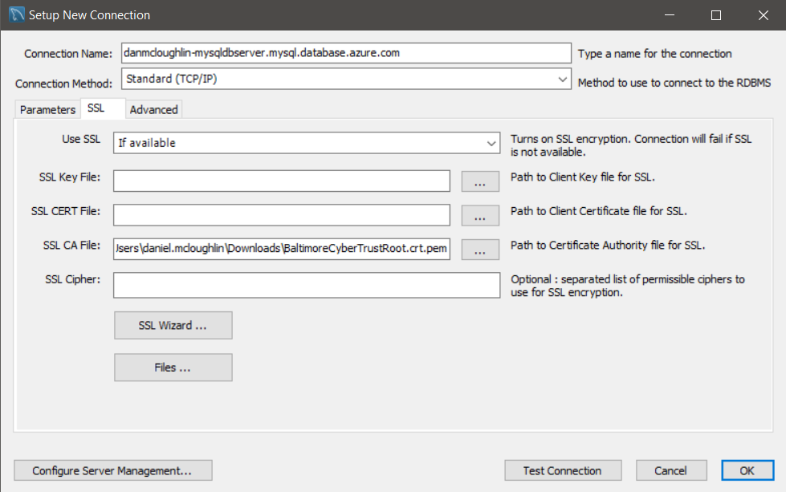

# Deploy a WordPress Web App

**WARNING - THIS IS A PUBLIC FACING REPOSITORY**

## Overview

Use this template to deploy a copy of the WordPress files, hosted in a Six Degrees public facing GitHub repo to a new Azure Web App.

Link: [Six Degrees Azure WordPress repo](https://github.com/sixdegreesazure/WordPress-On-Azure-Web-App-MySQL-TLS-SSL)

## Prerequisites
- An existing Linux based App Service Plan
- An existing Azure Database for MySQL resource with SSL enforced and TLS 1.2 enabled
- A schema already created with an associated MySQL username and password
  
<!-- - An existing Linux based App Service Plan ([template](https://github.com/sixdegreesazure/6dg-azure-deployment-standards/tree/master/azure-resources/app-service-plan/arm-templates/linux)).

### MySQL setup

- An existing Azure MySQL instance ([template](https://github.com/sixdegreesazure/6dg-azure-deployment-standards/tree/master/azure-resources/mysql)).

- TLS 1.2 and SSL enforcement enabled on the MySQL server ([Download the 'Baltimore CyberTrust Root' PEM from here](https://www.digicert.com/kb/digicert-root-certificates.htm)). You will need this to connect to the database remotely.

- MySQL Workbench - required to get remote access to the MySQL server. [Download from here](https://dev.mysql.com/downloads/workbench/). You set the root credentials during deployment and can get the hostname and port etc via the Azure portal. Setup MySQL Workbench as per the below:

[](./_images/workbench01.png)<br />
[](./_images/workbench02.png)<br />

- Run the below SQL (in Workbench) to create a new database, database user and password for a new WordPress install:

```
CREATE SCHEMA `wordpress01` DEFAULT CHARACTER SET utf8 ;

CREATE USER 'wordpress01user'@'%' IDENTIFIED BY 'StrongPassword!';

USE `wordpress01`;

GRANT ALL PRIVILEGES ON `wordpress01` . * TO 'db_user'@'%';

FLUSH PRIVILEGES;
``` -->

## Deployment:

Click the button below to deploy a new WordPress instance.

This will:
- Create a new Azure Web App, linking it to the existing App Service Plan. The database details will be set as Application Settings. The code will be pulled from the [Six Degrees Azure WordPress repo](https://github.com/sixdegreesazure/WordPress-On-Azure-Web-App-MySQL-TLS-SSL).

<a href="https://portal.azure.com/#create/Microsoft.Template/uri/https%3A%2F%2Fraw.githubusercontent.com%2Fsixdegreesazure%2FDeploy-WordPress-On-Azure-Web-App-Public%2Fmain%2Farm%2Ftemplate.json " target="_blank">
  
</a>


<!-- 

https://docs.microsoft.com/en-us/azure/azure-resource-manager/templates/deploy-to-azure-button

-->